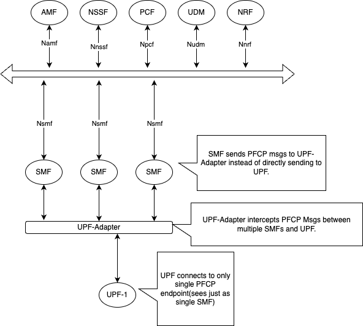

<!--
SPDX-FileCopyrightText: 2024 Intel Corporation
SPDX-FileCopyrightText: 2024 Canonical Ltd.
SPDX-License-Identifier: Apache-2.0
-->
<!--  -->

# upfadapter

`upfadapter` is required to scale the SMF's in SD-Core. The SMF sends custom PFCP messages to `upfadapter`, which intercepts and modifies specific fields before sending the messages to the UPF. 

